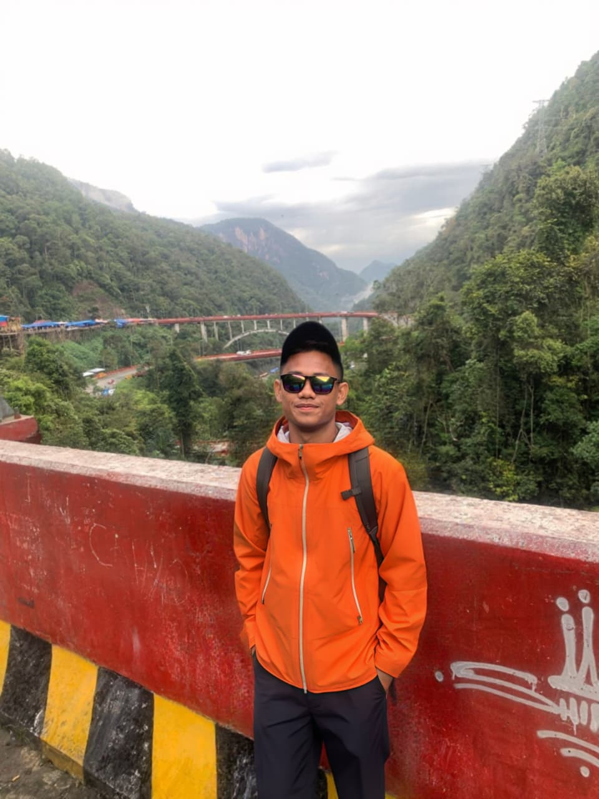

  <picture>
    <source media="(max-width: 760px) and (prefers-color-scheme: dark)" srcset="./assets/hero/agent-console-v5-mobile-dark.svg">
    <source media="(max-width: 760px)" srcset="./assets/hero/agent-console-v5-mobile-light.svg">
    <source media="(prefers-color-scheme: dark)" srcset="./assets/hero/agent-console-v5-dark.svg">
    <source media="(prefers-color-scheme: light)" srcset="./assets/hero/agent-console-v5-light.svg">
    
  </picture>

  

## About Me

I am **Samuel Kristiadi Siburian**, a President University Pekanbaru student focused on the intersection of **AI agents, Web3 trust, and on-chain intelligence**.

My current research direction centers on AI Agent systems with faculty collaboration, while my builder work explores how autonomous software can reason, transact, verify risk, and coordinate safely across blockchain networks. I am also preparing for a future graduate path in AI, with a long-term interest in trustworthy agentic systems.

## Current Focus

| Area | What I am exploring |
| --- | --- |
| **AI Agents** | Autonomous workflows, tool use, agent reliability, and applied agent systems. |
| **Web3 Trust** | Safer transaction layers, address intelligence, and user-facing risk signals. |
| **On-chain Intelligence** | Multi-chain analytics, threat detection, and blockchain-native verification. |
| **Agentic Payments** | API monetization, x402-style flows, Stellar settlement, and wallet UX. |

## Featured Work

| Project | Focus | Why it matters |
| --- | --- | --- |
| [**Fradium**](https://github.com/fradiumofficial/fradium) | AI-powered Web3 trust layer | Multi-chain address analysis, transaction insights, and AI threat detection for safer Web3 activity. [Live](https://fradium.io) |
| [**AgentPay**](https://github.com/wildanniam/AgentPay) | Agent-native API payments | An x402-powered marketplace where AI agents can discover paid APIs and settle requests with Stellar testnet USDC. [Live](https://agent-pay-jet.vercel.app) |
| [**Nova AI Wallet**](https://github.com/OfficialNovaAI/nova-wallet) | AI wallet orchestration | A chat-first wallet layer for on-chain analysis, transaction preparation, and crypto payment workflows. [Live](https://nova-wallet-puce.vercel.app) |
| [**Crucible**](https://github.com/antech2-async/crucible) | Autonomous agent accountability | A coordination layer where agents register, stake, complete tasks, and are rewarded or slashed through verifiable outcomes. [Live](https://crucible-kappa-gules.vercel.app) |
| [**SpecHeal**](https://github.com/antech2-async/SpecHeal) | AI-assisted test recovery | A recovery cockpit for Playwright UI failures that separates safe selector healing from real product bugs. [Live](http://merge-kalau-berani.hackathon.sev-2.com) |
| [**PayGate Stellar**](https://github.com/wildanniam/paygate-stellar) | API micropayment middleware | A concept for helping developers monetize API endpoints through Stellar-based micropayments. [Live](https://paygate-stellar.vercel.app) |

## Research Direction

I am especially interested in systems where AI agents do more than generate text: they observe state, call tools, reason over risk, coordinate with other agents, and take bounded actions with transparent evidence.

My current north star is to build and study **trustworthy autonomous systems** that can operate across real-world software and blockchain environments without hiding the reasoning, verification, and safety layers behind the interface.

## Tech Stack

  
  
  
  
  
  
  
  
  
  
  

## Recent Activity

<!-- AUTO:ACTIVITY:START -->
- Jul 16, 2026: opened pull request [#8](https://github.com/wildanniam/web-portfolio) in [wildanniam/web-portfolio](https://github.com/wildanniam/web-portfolio).
- Jul 16, 2026: pushed 1 commit to [wildanniam/web-portfolio](https://github.com/wildanniam/web-portfolio).
- Jul 16, 2026: created a branch in [wildanniam/web-portfolio](https://github.com/wildanniam/web-portfolio).
- Jul 16, 2026: opened issue [#7](https://github.com/wildanniam/web-portfolio/issues/7) in [wildanniam/web-portfolio](https://github.com/wildanniam/web-portfolio).
- Jul 16, 2026: opened pull request [#6](https://github.com/wildanniam/web-portfolio) in [wildanniam/web-portfolio](https://github.com/wildanniam/web-portfolio).
- Jul 16, 2026: opened issue [#5](https://github.com/wildanniam/web-portfolio/issues/5) in [wildanniam/web-portfolio](https://github.com/wildanniam/web-portfolio).
<!-- AUTO:ACTIVITY:END -->

---

  Building at the edge of AI agents, Web3 trust, and autonomous software.

        
     
     
 

Welcome to my GitHub page. I'm a student at President University Pekanbaru, Samuel. I'm currently learning new things about Cybersecurity, using multiple languages programming ​​and technologies.

 
&nbsp;&nbsp;&nbsp;&nbsp;&nbsp;&nbsp;&nbsp;&nbsp;

## My favorite tools and technologies ⚙️

<h3 align="center">Tools and technologies that I have worked with and am interested in</h3>

<table>
  <tr>
    <td align="center" width="96">
      
       Python
    </td>
    <td align="center" width="96">
        
       Javascript
    </td>
    <td align="center" width="96">
        
       Github
    </td>
    <td align="center" width="96">
        
         Ts
    </td>
    <td align="center" width="96">
        
       C++
    </td>
    <td align="center" width="96">
        
       Linux
    </td>
    <td align="center" width="96">
        
       Laravel
    </td>
  </tr>
  <tr>
    <td align="center" width="96">
        
       Git
    </td>
    <td align="center" width="96">
        
       php
    </td>
    <td align="center" width="96">
        
       HTML
    </td>
    <td align="center" width="96">
        
       CSS
    </td>
    <td align="center" width="96">
        
       Bootstrap
    </td>
    <td align="center" width="96">
        
         Java
    </td>
    <td align="center" width="96">
        
         mysql
    </td>
    </tr> 
        <tr> 
        </tr>
    </table>

<picture>
  <source media="(prefers-color-scheme: dark)" srcset="https://raw.githubusercontent.com/platane/platane/output/github-contribution-grid-snake-dark.svg">
  <source media="(prefers-color-scheme: light)" srcset="https://raw.githubusercontent.com/platane/platane/output/github-contribution-grid-snake.svg">
  
</picture>
